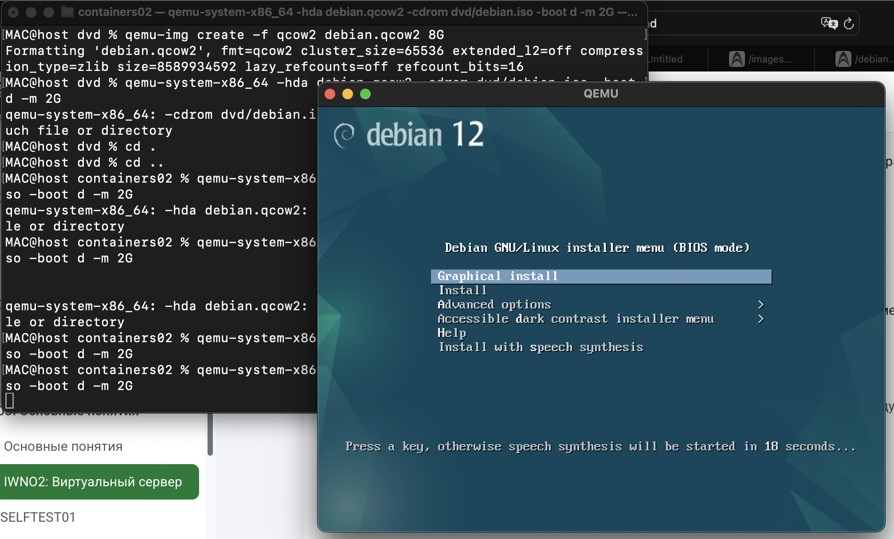
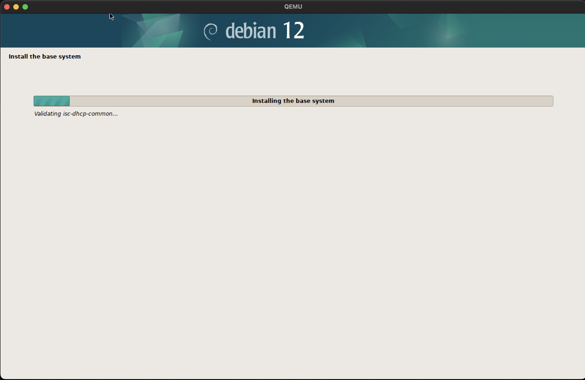
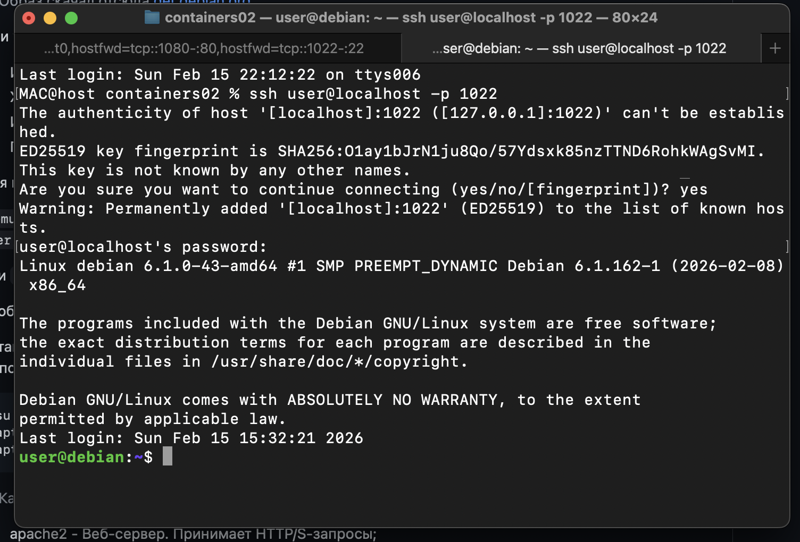
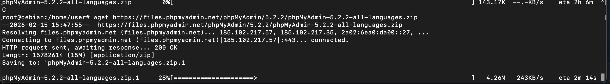
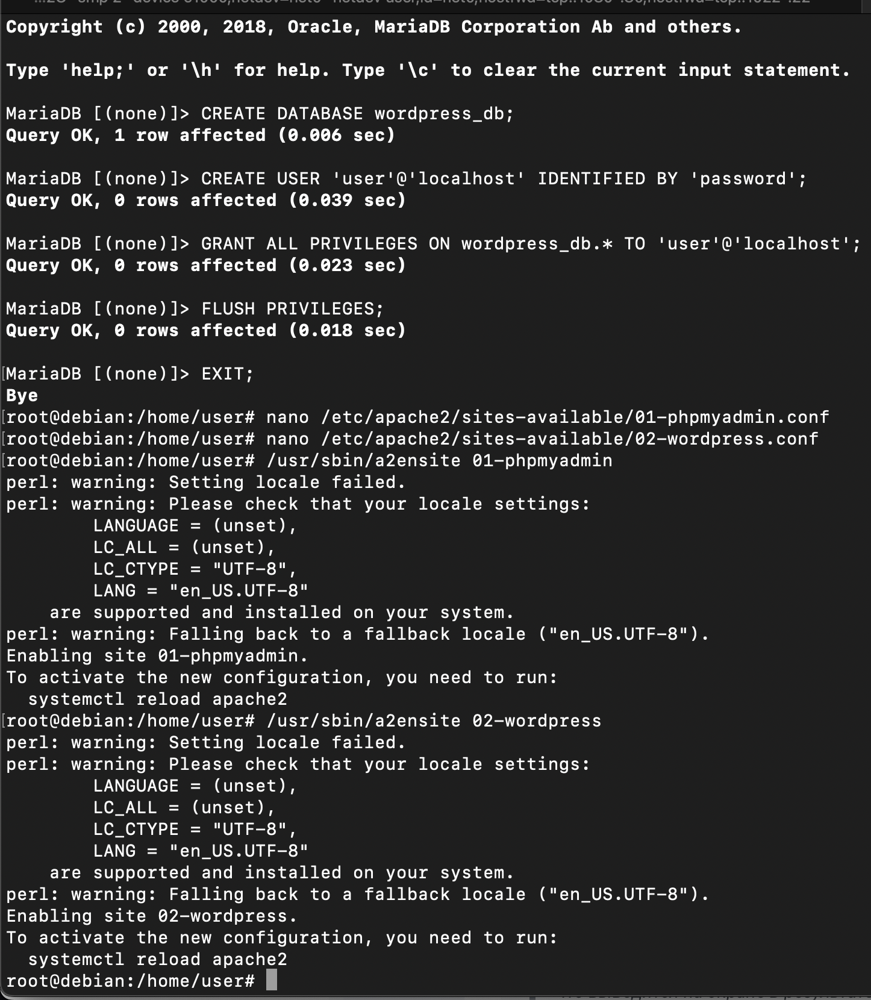
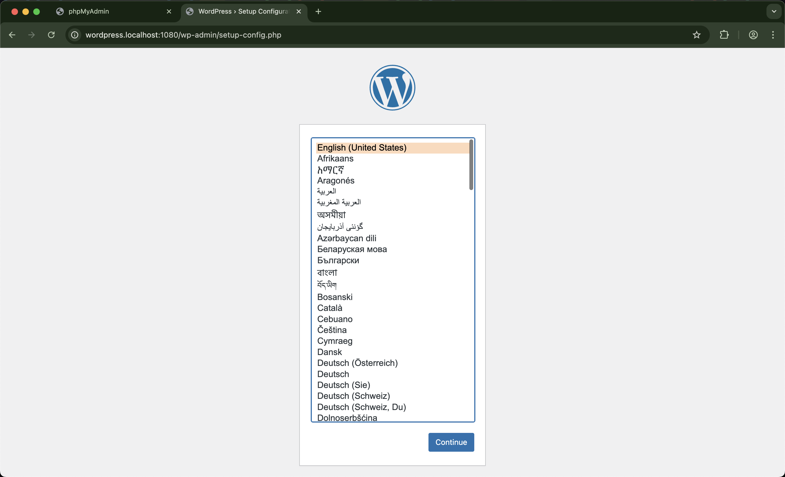
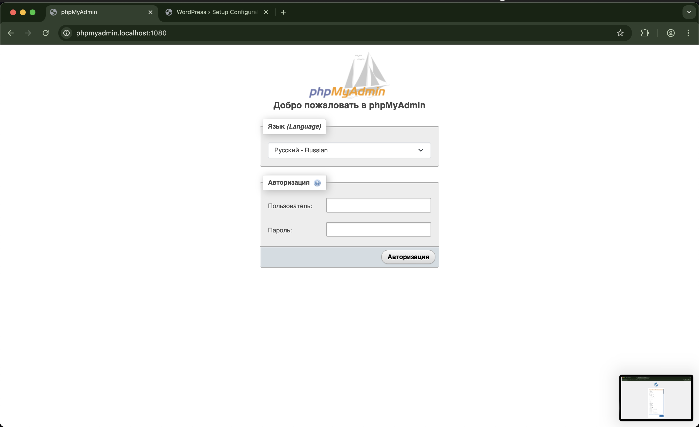

# Лабораторная работа 2: Виртуальный сервер Debian + LAMP

**Студент:** `Voronetchii Stanislav`  
**Группа:** `IA2404`  
**Дата выполнения:** `15.02.2025`

## Описание задачи
Выполнить установку Debian Server в QEMU, настроить окружение LAMP (Apache, MariaDB, PHP), развернуть WordPress и phpMyAdmin на отдельных virtual host, проверить доступ через проброшенные порты и оформить отчет.

## Ход выполнения работы

### 1. Подготовка репозитория и файлов
В репозитории `containers02` создана структура проекта:
- каталог `dvd` для ISO-образа;
- файл `.gitignore` с масками для временных/бинарных артефактов (`*.qcow2`, `*.iso`, `*.zip`);
- образ Debian размещен как `dvd/debian.iso`.

### 2. Создание диска виртуальной машины
Создан диск QEMU формата `qcow2` размером 8 ГБ:

```bash
qemu-img create -f qcow2 debian.qcow2 8G
```

Скриншот запуска команды и старта установки:



### 3. Установка Debian в QEMU
Установка выполнялась командой:

```bash
qemu-system-x86_64 -hda debian.qcow2 -cdrom dvd/debian.iso -boot d -m 2G
```

Во время установки использованы параметры из задания:
- имя компьютера: `debian`;
- хостовое имя: `debian.localhost`;
- пользователь: `user`;
- пароль: `password`.

Скриншот процесса установки:



### 4. Запуск VM после установки и подключение по SSH
Запуск после установки:

```bash
qemu-system-x86_64 -hda debian.qcow2 -m 2G -smp 2 -device e1000,netdev=net0 -netdev user,id=net0,hostfwd=tcp::1080-:80,hostfwd=tcp::1022-:22
```

Подключение:

```bash
ssh user@localhost -p 1022
```

Скриншот подключения:



### 5. Установка LAMP
Установка выполнена командами:

```bash
su
apt update -y
apt install -y apache2 php libapache2-mod-php php-mysql mariadb-server mariadb-client unzip
```

Назначение пакетов:
- `apache2` — веб-сервер, принимает HTTP/HTTPS-запросы;
- `php` — интерпретатор PHP;
- `libapache2-mod-php` — модуль Apache для выполнения PHP-скриптов;
- `php-mysql` — расширение PHP для подключения к MariaDB/MySQL;
- `mariadb-server` — сервер СУБД MariaDB;
- `mariadb-client` — консольный клиент для работы с MariaDB;
- `unzip` — распаковка архивов `.zip`.

### 6. Скачивание и распаковка phpMyAdmin и WordPress
Скачивание:

```bash
wget https://files.phpmyadmin.net/phpMyAdmin/5.2.2/phpMyAdmin-5.2.2-all-languages.zip
wget https://wordpress.org/latest.zip
```

Скриншот `wget`:



Распаковка и перенос:

```bash
mkdir /var/www
unzip phpMyAdmin-5.2.2-all-languages.zip
mv phpMyAdmin-5.2.2-all-languages /var/www/phpmyadmin
unzip latest.zip
mv wordpress /var/www/wordpress
```

### 7. Создание БД и пользователя для WordPress
В MariaDB выполнены команды:

```sql
CREATE DATABASE wordpress_db;
CREATE USER 'user'@'localhost' IDENTIFIED BY 'password';
GRANT ALL PRIVILEGES ON wordpress_db.* TO 'user'@'localhost';
FLUSH PRIVILEGES;
EXIT;
```

### 8. Настройка virtual host в Apache
Созданы конфиги:
- `/etc/apache2/sites-available/01-phpmyadmin.conf`;
- `/etc/apache2/sites-available/02-wordpress.conf`.

Оба сайта зарегистрированы:

```bash
/usr/sbin/a2ensite 01-phpmyadmin
/usr/sbin/a2ensite 02-wordpress
```

Также добавлены записи в `/etc/hosts`:

```text
127.0.0.1 phpmyadmin.localhost
127.0.0.1 wordpress.localhost
```

Скриншот SQL и `a2ensite`:



### 9. Запуск и тестирование
Проверка системы выполнена командой:

```bash
uname -a
```

Вывод: 
```bash
Darwin host 23.6.0 Darwin Kernel Version 23.6.0: Mon Jul 29 21:14:21 PDT 2024; root:xnu-10063.141.2~1/RELEASE_ARM64_T8103 arm64
```

Перезагрузка Apache:

```bash
systemctl reload apache2
```

Доступность сайтов подтверждена:
- `http://wordpress.localhost:1080`
- `http://phpmyadmin.localhost:1080`

Скриншоты открытых сайтов:





## Ответы на вопросы

### 1. Каким образом можно скачать файл в консоли при помощи утилиты wget?
Базовый синтаксис:

```bash
wget <URL>
```

Примеры:

```bash
wget https://wordpress.org/latest.zip
wget -O wordpress.zip https://wordpress.org/latest.zip
```

### 2. Зачем необходимо создавать для каждого сайта свою базу и своего пользователя?
Это изоляция и безопасность. Каждый сайт получает только нужные права к своей БД, что снижает риск повреждения данных других приложений и упрощает администрирование/резервное копирование.

### 3. Как поменять доступ к системе управления БД на порт 1234?
Так как доступ идет через проброс порта QEMU, нужно изменить параметр `hostfwd` при запуске VM:

```bash
-netdev user,id=net0,hostfwd=tcp::1234-:80,hostfwd=tcp::1022-:22
```

После этого открыть `http://phpmyadmin.localhost:1234`.

### 4. Какие преимущества дает виртуализация?
- изоляция окружений;
- быстрый запуск/переносимость;
- снимки и удобное восстановление;
- эффективное использование ресурсов хоста;
- безопасные эксперименты без риска для основной ОС.

### 5. Для чего необходимо устанавливать время/временную зону на сервере?
Корректное время нужно для логов, cron-задач, SSL-сертификатов, мониторинга, аудита и корректной синхронизации между сервисами.

### 6. Сколько места занимает установленная ОС (виртуальный диск) на хостовой машине?
Файл виртуального диска `debian.qcow2` занимает около **2.9G** на хостовой машине.

### 7. Какие есть рекомендации по разбиению диска для серверов и почему?
Обычно выделяют отдельные разделы для `/`, `/var`, `/home`, `swap` (иногда `/boot`). Это повышает отказоустойчивость, упрощает контроль заполнения и улучшает безопасность.

## Выводы
В ходе работы развернута серверная Debian в QEMU, настроен стек LAMP, выполнена публикация двух сайтов на отдельных virtual host и подтверждена доступность сервисов через проброшенные порты. Практика показала, что виртуализация удобна для безопасного тестирования и развертывания серверной инфраструктуры.
